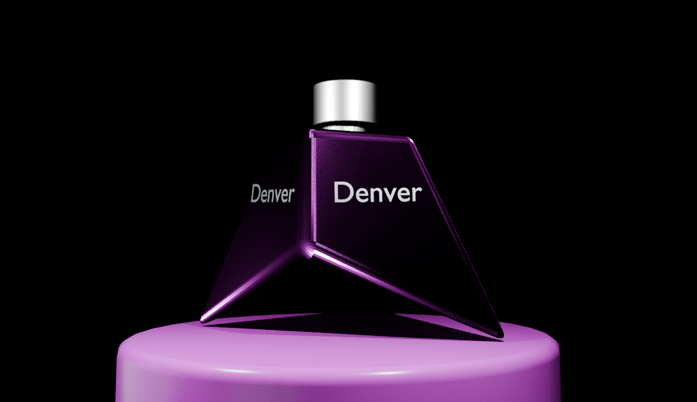

# Blender 3D Projects – Rubik's Cube & Perfume Denver

# Overview

This repository showcases two 3D modeling projects created using Blender:

Rubik's Cube – A detailed, animated representation of the classic puzzle.

Perfume Bottle (Denver) – A realistic 3D model of a perfume bottle exploring materials, textures, and lighting.

These projects highlight Blender's capabilities in 3D modeling, animation, and rendering, while providing visually engaging and interactive models.

# Features

# Rubik's Cube

3D Modeling: Accurate cube geometry with proper proportions.

Animation: Rotations demonstrating the cube's mechanics.

Materials & Textures: Colorful cube faces with realistic surface appearance.

Lighting: Depth and shadows for realistic rendering.

# Perfume Bottle (Denver)

3D Modeling: Detailed bottle design with elegant curves and geometry.

Materials & Textures: Glass transparency, reflective surfaces, and label textures.

Lighting & Rendering: Realistic lighting setup to enhance reflections and shadows.

# Skills Learned

Blender interface & navigation

Mesh creation & modification techniques

Keyframe animation for smooth motion

Applying materials, textures, and reflections

Lighting setup for realistic rendering

Images / Preview
Rubik's Cube

Perfume Bottle (Denver)

Getting Started

To view and interact with these projects:

# Clone the repository:

git clone https://github.com/Shaswatchoudhary/MyBlenderfiles.git

Open the project in Blender (ensure Blender is installed). 🖱️💻

Open the .blend files to explore the models, materials, textures, and animations in detail. 🔍📂

# License

This project is licensed under the MIT License, allowing free use, modification, and distribution. 📝✨
For details, see the LICENSE file in the repository. 📄🔒
